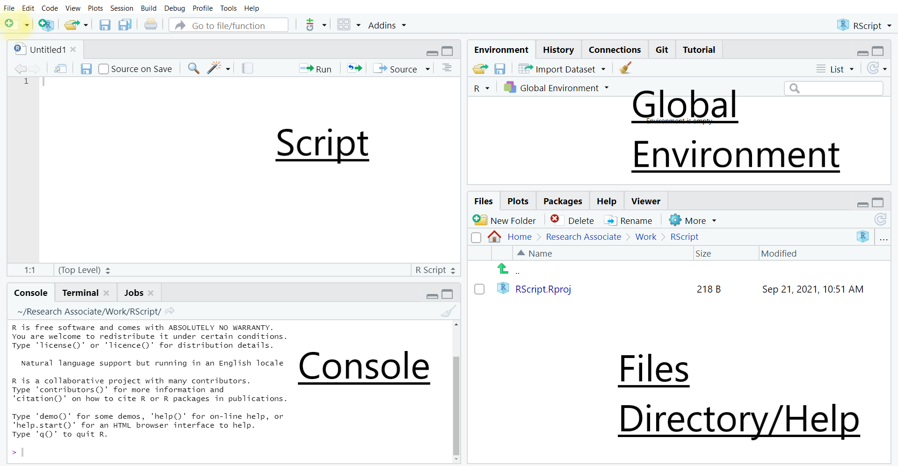

# Using R: essential information
## Download and installation 

R can be downloaded for free from the [CRAN
website](https://cran.r-project.org/) and run like any other Windows
application. Versions for Mac and Linux are also available.  After installation,
the standard and rather minimalist R interface that appears when the programme
is launched is shown below.

```{r 2.1, echo=FALSE,fig.cap="The standard R interface",fig.pos="H",out.width = "500pt", fig.alt="Screenshot of the standard R Windows interface"} 
knitr::include_graphics("pics/screen2.1.jpg")
``` 


This interface merely allows the user to type in commands one by one in the
console, and to install packages via pull-down menus.  However, this basic
installation, although fully functional, is rather minimal, not very ergonomic
or user friendly.   As with other statistical software, the primary way of
interacting with R for most  is to write programs, even basic ones in a syntax
file (also called script file) that is saved and run whenever needed, which is
not directly feasible with the standard R GUI.

It is therefore highly recommended to  use  R via an Integrated Development
Environment (ie a more sophisticated user interface) such as
[RStudio](https://www.rstudio.com/products/rstudio/download/) for beginners to
intermediate users or the [StatEt module](https://www.eclipse.org/statet/news/)
for  [Eclipse](https://www.eclipse.org/downloads/)  for more advanced
programmers. Both are free, available for Windows, MacOS and Linux and offer
users  a large number of  additional functionalities, such as syntax
highlighting, integration with Github. Given that it probably has the largest
number of users RStudio will be used to demonstrate examplkes of R syntax in
the remainder of this document. In order for this guide to remain as universal
as possible, we will not rely on the advanced features of RStudio, instead using
it merely as an interface to the R engine. 

## Installing and setting up RStudio

RStudio needs to be installed separately from R. The program can be downloaded
from  [the RStudio website](https://www.rstudio.com/products/rstudio/download/).
The site will automatically generate  a link to the version most compatible with
 the computer used to access it. Once downloaded double click on the file  and
follow the installation instructions. 

By default, the R Studio interface consists of  four main panels, respectively
known as the script editor (top left panel), the console (bottom left panel),
the Environment (top right panel) and the File/Directory/Help (bottom right
panel).

```{r 2.2,echo=FALSE, fig.cap="The R Studio default interface",out.width = "500pt", fig.alt="Screenshot of the standard RStudio interface with four panes: top left: script; bottom left: console; top right: global environment; bottom right: files or help" }

```
As such a complex interface can be visually overwhelming for some users and is
not required for the purpose of  this guide, we will minimise the Global
Environment and Files/Directory/Help panels by clicking in the center of the
window and dragging right to the edge of the screen. This way, only the script
and console  panels remain visible.   The tiling of the panels can be customised
in `Tools>Global Options>Pane Layout`. For instance, Script can be moved to the
bottom of the window and Console to the top: 
```{r 2.3,echo=FALSE, fig.cap="A customised R Studio interface",out.width = "500pt", fig.alt="Screenshot of the customised R Studio interface, with the console pane at the top and the script pane at the bottom" }
knitr::include_graphics("pics/screen2.3.png")
```


## Interacting with R

As already mentioned, one can type R commands directly in the console of RStudio
and/or by typing sequences of commands in a script file. 

Most R commands adopt the following syntax: 

``` 
> command(parameter1, parameter2, ...) 
```
`All` R commands are followed by brackets, even if there are no parameters. 

In the following example we are going to set up the default working directory, that is  the default location for opening and storing files, by using the `getwd()` and `setwd()` commands. First, let us visualise the current default working directory.

```{r 2.4}
getwd()
```

Let us say we would like the code from this guide to be all in a folder called ‘R_UKDS’, to be located in ‘My Documents’.  To tell R to use the folder ’R_UKDS, we can either create it from within Windows or ask R to do it for us.  So type: 

For Windows: 

```
> setwd("C:/Documents and Settings/<INSERT YOUR USERNAME HERE>/My Documents/R_UKDS") 
```
For Mac:
```
> setwd("/Users/<INSERT YOUR USERNAME HERE>/Documents/R_UKDS") 
```
For Linux:
```{r 2.5}
dir.create("~/Documents/R_UKDS")
setwd("~/Documents/R_UKDS")
```

Typing `getwd()`  confirms that the change has been recorded. 

```{r 2.6}
getwd()
```
**Notes:**

- Any character string that is neither a command or the name of an object (such
  as a variable name) needs to be put between inverted commas or quotation
  marks, otherwise it will be interpreted as the name of an object
  - see the example below about loading user-created packages;

- Even when no parameters are specified for a command, brackets are compulsory
  as shown in the `getwd()` example above;

- R uses forward slashes rather than backslashes (unlike most other
  Windows applications) to separate directories. Using backlashes will return an
  error message;
- Although most R commands accept a large number of options to be specified,
  in many cases default values have been ‘factory set’ so that only the
  essential parameters need specifying.

The output of most R commands can be either directly displayed on the screen (as
in the above example) or stored in objects that can be subsequently reused in
further commands. This object-oriented feature separates R from traditional
statistical software.

For instance, typing: 

```
>	a<-getwd()
```

will store the output of `getwd()`  (that is, the name of the current default directory)  into an object called ‘a’. In order to view the content of a, one can just type its name: 
```
>	a
```


<!-- Another approach to set a working directory is by creating an R Project. To learn more about why and how to set working directory in R and see how an R project is generated, see the “Setting a working directory” section in our Data Skills Module: Exploring crime surveys with R. -->

#### Writing R scripts  via R Studio {-}
Most users will want to write their code in a script file, similar to the ‘do’ file in Stata or syntax file in SPSS.  R script files end with the .R suffix. To open an existing  R script in RStudio select `File>Open File` then  the relevant script file. To create a new script  select `File>New File>Open File` (shortcut: Control+Shift+N) this will open a new script window in which to type commands.


## Installing and loading packages
Apart from a basic set of commands and functions, most of the tools offered by R are available in packages that are not provided during the main installation and need to be installed and downloaded separately from within R. 
For example, to install the ‘foreign’ package one need to type: 

```
install.packages("foreign",repos = "https://cloud.r-project.org")
```

Installation only needs to be done once. 
If the address of the  package repository is not specified via the  `repos` option, a pull-down menu will appear, asking for one. Choosing `https://cloud.r-project.org` will automatically select the closest mirror site. 

Originally, `Foreign`  enabled  users to import Stata (version 12 or older) or SPSS datasets. For  Stata datasets saved under version 13 and above, the `haven` or `readstata13` package are required. 

```
install.packages("haven",repos = "https://cloud.r-project.org")
```
To use a package already  installed in  the local  R library,  the `library()` command is needed:

```{r 2.7}
library(foreign)
```

Simply typing: 

```
> library()
```
Will list all libraries installed on the computer that can be loaded in memory. This can be a rather long list!

<!-- For users who feel more comfortable using ‘click-and-point', there is also the option to use ‘Install Packages’ from the Packages tab in the main R window. This will display a list of packages available in alphabetical order for the user to choose from. Next, select the desired package, double click on it and press ‘OK’ for the installation to begin. -->

Besides a full archive of R packages, the CRAN website provides a series of manuals,  including [Writing R Extensions](https://cran.r-project.org/doc/manuals/R-exts.html), which describes how users can write their own packages and submit them to CRAN. 

Once a package is installed, it will be permanently stored in the local R library on the computer, unless  deleted it with  the `remove.packages()` command (not advised as this can break dependencies between packages!).
```
> remove.packages("name of the package")
```
Packages required  for an analysis have to be loaded every time a new R session is started (But not every time a syntax file is run!).  


##  Getting help
Within R, the most straightforward way to request help with a command consists of a question mark followed by the command name, without a space in between.  The standard help system in R (unless using RStudio or Eclipse) relies on the default web browser installed on your computer (ie Chrome, Firefox or Edge in most cases) to display pages. 
Typing: 

```
> ?getwd 
```
Is equivalent of: 
```
help('getwd')
```
and will open the help page for the `getwd()` command in the default web browser. If you are using RStudio or Eclipse, the help will most likely open in a new tab within the program. 

This will work for any command directly available in the `Base` package that is loaded at startup or  in other packages loaded via the `library()` command. Otherwise, R will return an error message.

Typing two question marks followed by a keyword will search all of R for the available documentation for that keyword:

```{r 2.8}
 ??foreign
```

An index of all commands and functions in the foreign package can be obtained by typing:

```{r 2.9}
help(package='foreign')
```
Note: this command only works because the ‘foreign’ package was previously loaded in memory with the `library()` command. More information about where to find help when using R is provided at the end of this document.


## Objects
R is an object oriented language, which means that almost any information it uses is stored as ‘objects’ (i.e. containers) that can be manipulated independently. During an R session, multiple objects are available simultaneously (for instance datasets, but also summary tables or new variables produced from it). 
Typing:
```
> ls()
```
will list all the objects that are currently in memory.

Objects belong to `classes` or types which have distinct `properties`. There are many classes of objects in R. By comparison, Stata has only macros, variables and scalars that are directly  available to most users. Common object classes include factors (these are equivalent to categorical variables), vectors (numerical variables – whether continuous or ordinal), data frames (datasets), matrices, etc. Not all operations are possible with all objects in R. More advanced users can also create their own object classes. Describing R objects and their properties is well beyond the purpose of this guide and users interested should consult the [online documentation](https://cran.r-project.org/doc/manuals/r-release/R-lang.html#Objects) for further explanations. 

To create or assign a value to an object, one uses the assignment operator  (<-). For example:
```
> x <- 5 
```

In this example we have assigned the value 5 to an object called x. If you type the letter x,  the value ‘5’ will be returned in your console. The object x will appear in the R environment after the ls() command. 

```{r 2.10}
x <- 5  
x
ls()
```

#### Deleting objects  {-}
The rm() function can be used to remove objects from the environment (session). These objects can be variables, lists, datasets, etc. For instance, to remove the object ‘x’, or the fictitious dataset called ‘mydata’: 

```{r 2.11}
rm(x)	
ls()
```

```
> rm(mydata)
```
<!-- The rm() function only works with R objects; but if you want to delete a specific variable of a dataset, you need a different function. For example, to delete the variable ‘age’ of the dataset ‘mydata’, an option is to set the variable to NULL:  -->

<!-- > mydata$age<-NULL  -->

<!-- There are other ways to delete variables from a dataset, but these will be looked at later on in this guide.  -->

#### Data frames {-}

Among the various classes of objects one may use in R, a few are essential to understand when analysing survey data. Their characteristics are briefly listed below;

Data frames are  objects that come closest to datasets or excel sheets in traditional statistical software. They are objects that have indexed rows and columns, both of which may have names. Data frames  columns can be seen as  variables and lines or rows as observations. Each  cell in the data frame can be uniquely identified by its position. Data frames are typically the object in which survey datasets are stored.


```{r 2.12,echo=F,message=F}
library(dplyr)
datadir<-"/home/piet/Dropbox/work/UKDS/RGuide/data/"
mydata<-read.spss(paste0(datadir,"bsa_spss/bsa2019_poverty_open.sav"),to.data.frame = T,max.value.labels=5)%>%select(RSex,skipmeal,Married,Poverty1,HEdQual3,NatFrEst)%>%slice(1:50)
mydata$Married<-as.character(mydata$Married)
```

Let's assume that we have a  small data frame called 'mydata'. Here are  a few basic commands to examine it:

**Determining the size of a data frame:** 
the `dim()` command returns the number of rows and columns of a data frame

```{r 2.13}
dim(mydata)
```
R tells us that our data is made of 50 rows and 6 columns, in other words of 50 observations and 6 variables. What if I want a quick overview of the dataset?

```{r 2.14}
head(mydata)
```
The `head()` command displays the first  six lines of the dataset. Depending on the number of variables  the output of   `head()` can become quickly overwhelming, as the size of the lines on most screens is limited!

**Obtaining the names of variables (or columns) in the dataset:**
This can be done using either  `ls()` which we already have used, or the `names()` commands. `ls()` returns the variables names, sorted alphabetically, whereas `names()` returns them in their actual order in the data frame.

```{r 2.15}
ls(mydata)
names(mydata)
```
We can see that in the data frame, the "RSex" column comes in fact before "Poverty1".

**Accessing variables:**

Each column of a data frame, or variable, can be accessed by its name preceded by the $ sign: 

```{r 2.16}
mydata$NatFrEst
```

Alternatively, columns/variables and rows can be identified numerically by their position in the data frame using square brackets: 
```
dataframe[row number,column number]
```
Given that `RSex` is the first column of our dataset

```{r 2.17}
mydata[,1]
```
Returns the same output as previously. Not specifying a row or column name within the square brackets tells R to display them all.   

```{r 2.18}
mydata[6,]
```
Returns the values of all the variables for the sixth row of the data frame. Specifying both a row and column number, will return a unique observation: 

```{r 2.19}
mydata[6,6]
```
which in this case is 10. 
Finally, more than one column or row can be displayed by concatenating their number using the `c()` function:

```{r 2.20}
mydata[c(6,9),c(1,6)]
```
The above command returns respectively the sixth and 9th observations for the  sixth column. Please note that columns names can also be used instead of their number, provided that they are put between inverted commas:

```{r 2.21}
mydata[c(6,9),c('RSex','NatFrEst')]
```
Returns the same result as previously.
Having a data frame to hand allows us to explore other types of objects commonly found in R. The type of a variable can  be displayed  by simply using the `class()` function. 

#### Numeric {-}

`Numeric` objects are simple numerical vectors (ie a single or a list of numbers). Here this is the case for `NatFrEst`, the estimated proportion of people making wrong benefits claims, according to respondents to the survey.  
```{r 2.22}
class(mydata$NatFrEst)
```
#### Character {-}
Character objects are alphanumeric vectors, that is variables which consist of text string(s).
```{r 2.23}
class(mydata$Married)
```
#### Factors {-}
 An important feature of R is that categorical variables whether ordinal or polynomial are stored in objects known as **factors**. The main difference between factors and traditional categorical variables in Stata or SPSS is that they do **not** consist of discrete numerical values with which value labels are associated. They should be thought of instead as a special type of character variable with a discrete set of values, which are known as `levels`. In our data, `Rsex` (Gender of the respondent) is such an object:   
```{r 2.24}
class(mydata$RSex)
```
Let's further examine this factor.

```{r 2.25}
levels(mydata$RSex)
```
returns the levels (ie the values) of  `RSex`. Even if 'Male' is the first level of `Rsex`,
and female the second one, these do not correspond to underlying numbers in the
data. Please also note that it is possible to change the ordering of factor
levels with the `factor()` function. It is always a good idea to check the ordering of factor levels in a newly created variable. 

```{r 2.26}
mydata$RSex.New<-factor(mydata$RSex,levels = levels(mydata$RSex)[c(2,1)])
levels(mydata$RSex.New)
```
The above code tells R to create a new factor variable -`RSex.New` - whose levels are the same as the initial `RSex`, but with  'Female' coming first, and "Male", second. The name of the new variable is arbitrary.

<!-- ##  Saving data  in R -->
<!-- library(RStata)-->

<!-- When working with data, it is very likely that the user will edit the original dataset, either by recoding variables or creating new ones, etc. In those cases, saving the progress made in the data used is crucial to avoid repeating every single operation in the next session working with the data. There are several ways of accomplishing this, depending on the format in which the data will be stored. The line of command used to save the data frame  called “mydata” is: -->
<!-- > save(mydata, file="mydata.Rda") -->

<!-- This command will save the data into a format that can be read by R. The first part of the command is referring to the data frame used in the current R session, while the section file=“mydata.Rda”, is referring to the data that will be saved in the working directory. The name of the saved file can be changed, for instance: -->
<!-- > save(mydata, file="mydata_Jan2021.Rda") -->

<!-- To load the saved .Rda data: -->
<!-- > load("mydata_Jan2021.Rda") -->
<!-- This command will work only if the working directory where the data is stored is defined in advance. Alternatively, the path to the folder where the data is saved can be specified. -->
<!-- > load("c:/mydocuments/mydata_Jan2021.Rda") -->

<!-- Another option to save the data is using the “foreign” package, so data can be exported to several formats, such as .txt, .cvs, .dta, which can be used in other software packages. The following example shows how to export data from R to a comma delimited format (.csv) that can be read in excel, Stata and SPSS. -->
<!-- > library(foreign) -->

<!-- >  write.csv(mydata, “mydata.csv”, row.names=FALSE)  -->
<!-- Another example is to export the data as a Stata file, using the foreign package previously loaded: -->

<!-- > write.dta(mydata, "mydata.dta")  -->

<!-- The newly created files will be stored in the project or working directory defined earlier on. -->
<!-- Some users will want to save the whole R project in which they are working. This would include functions, variables, data (in R it is possible to load and work with more than one dataset at a time). This option is very handy, especially when working with several datasets.  -->
<!-- Thus, another approach is to save the current session or workspace as an image, using the save.image command, specifying the path where the workspace will be saved. For example, to save ‘my current session’ in R, one needs to write the following command, making sure to include the .RData extension. -->
<!-- > save.image("c:/Folder/my_current_session.RData") -->

<!-- Instead, a workspace can also be saved using the graphical interface:  -->

<!-- File… Save workspace…  -->

<!-- This will open a window to save the workspace in a particular folder, which can be different from the current working directory. The name needs to be specified in the ‘File name’ section. The workspace will be saved in the chosen folder as an .RData file. -->

<!-- Insert the screenshot here -->

<!-- The data can be retrieved using the load function: -->
<!-- > load("c:/Folder/my_current_session.RData") -->

<!-- Or using graphical interface as follows: -->

<!-- File -> load workspace -->

\newpage                                            
