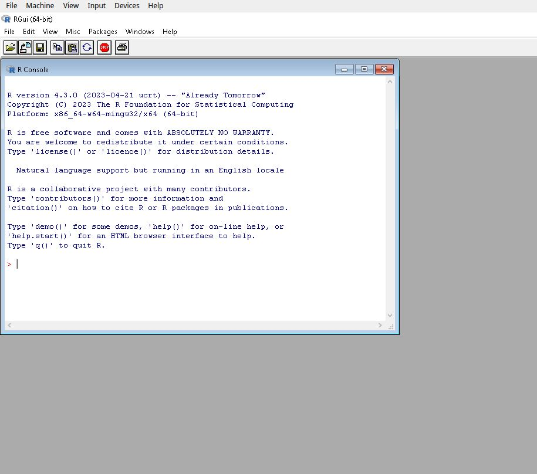
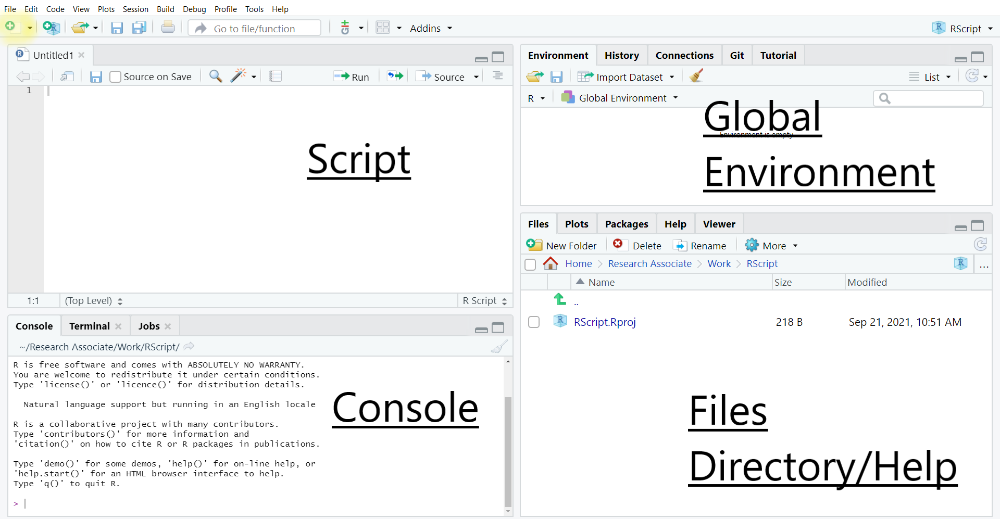
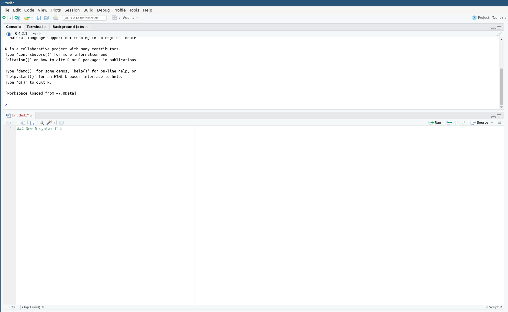

```{r setup, include=FALSE}
options(
  htmltools.dir.version = FALSE, formatR.indent = 2,
  width = 55, digits = 4, warnPartialMatchAttr = FALSE, warnPartialMatchDollar = FALSE
)
library(dplyr)
library(Hmisc)
library(ggplot2)
```

<!--chapter:end:index.Rmd-->

# Introduction
This guide provides an introduction to analysing large scale social survey
dataset using R with examples from the British Social Attitudes Survey 2020. It
is aimed at two categories of users: 

1. Those outside higher education, or who do not have access to one commonly used commercial statistical  software such as Stata, SPSS or SAS but who would like to conduct their own analysis beyond what is usually published by data producers such as the Office for National Statistics (for example statistics 
for specific groups of the population). This guide provides this group of users with a range of procedures that will help them produce straightforward and robust 
analyses tailored to their needs without spending unnecessary time on learning the inner workings of R. 

2. More advanced users who are already familiar with other data analysis tools but who would like to learn how to carry out their analyses in R. 
The guide therefore focuses on providing succinct  examples of common operations that most users carry out in the course of their research, including how to: 

- read in and open datasets. 

- do common data manipulation operations. 

- produce simple descriptive statistics or tabulations. 

- use survey weights. 

By contrast with other statistical software,  the R interface is rather minimal
and consist merely of a terminal.  In line with programming languages such a
Python or C, R users tend to access it via an interface, or Integrated
Development Environment (IDE).  This guide uses the R Studio development
environment, one of the most common IDE for R. The data used in this guide is
the [British Social Attitudes Survey, 2017, Environment and Politics: Open
Access Teaching
Dataset](https://beta.ukdataservice.ac.uk/datacatalogue/studies/study?id=8849),
which can be downloaded from the UK Data Service website without registration.
The website also has instructions on how to acquire and download large-scale
survey datasets. Links and further information about the other training
resources available online are provided at the end of this document. 

## What is R ?

R is a free, user developed, object-oriented statistical programming language
that  originates in the ‘S’ and ‘S Plus’ languages developed during the 1970s
and 1980s. It has a large audience in the science and statistics communities and
is increasingly used in the social sciences for teaching and research purposes. 

Anyone can install and use R without charge, and to some extent contribute to
and amend the existing program itself. R can be downloaded from the
[Comprehensive R Archive Network (CRAN)](https://cran.r-project.org/) website.
Installation instructions as well as guides, tutorials and FAQ are available on
the CRAN website.

R is particularly favoured by users who want to develop their own statistical
functions or implement technical advances that are not yet available in
commercial packages. The existence of a vast number of user written packages
(17,672 at the time of writing this guide)  is one of the great strengths of R.
Users who want to contribute should be aware that in order to be part of the R
archive, a minimum set of rules need nonetheless to be followed.

Although R can perform most of the analyses  available in generalist  software
such as Stata, SPSS, or SAS, it has a broader potential since it can also be
used for mapping, data mining or machine learning. Being a language also means
that there are often several ways to carry out analyses in R, each one with its
advantages and inconvenient. Users can also easily produce  publication quality
output from R thanks to its integration with the Markdown LaTeX document
presentation system, and R graphs can also be imported into MS Word or
LibreOffice documents.

<!-- ## Pros and cons of R relative to other statistical software -->
Although R has advantages over other statistical analysis software, it also has
a few downsides, both of which are summarised below.  Users should be reminded
that as open-source software, R and its packages are developed by volunteers,
which makes it a very flexible and dynamic project, but at the same time reliant
on developers’ free time and goodwill.

```{r table,echo=F}
knitr::kable(col.names=c("Pros","Cons"), align = 'l',format="markdown",
rbind(
c(("R is free and allows users to perform  almost any analysis they want."),("The learning curve may be steep for users who  do not have a prior background in statistics or  programming.")),
c(("R puts statistical analysis closer to the reach of  individual citizens rather than specialists."),""),
c("",""),
c(("Transparency of use and programming of the software  and its routines, which improves the peer-reviewing  and quality control of the software in many cases."),""),
c(("Very flexible."),("Problem solving (for both advanced users  and beginners)  may be time-consuming, depending  on how common the problem encountered,  and may lead to more time spent solving  technical rather than substantive issues.")),
c("",""),
c(("Availability of a wide range of advanced techniques not provided in other statistical software"),("Many people who design R packages are,   or will become busy academics. Packages  can stop being maintained without notice.")),
c("",""),
(c("A very large user base provides abundant  documentation, tutorials, and web pages.",""))
)
,booktabs = TRUE,
,escape = F,
  caption = 'Advantages and inconvenients of R'
)
```

There are several (sometimes many) ways of achieving a particular result in R.
This can be confusing for novice researchers, but at the same time will allow  users to
tightly adjust their programmes to their needs
\newpage

<!--chapter:end:01-Introduction.Rmd-->

# Using R: essential information
## Download and installation 

R can be downloaded for free from the [CRAN
website](https://cran.r-project.org/) and run like any other Windows
application. Versions for Mac and Linux are also available.  After installation,
the standard and rather minimalist R interface that appears when the programme
is launched is shown below.

```{r 2.1, echo=FALSE,fig.cap="The standard R interface",fig.pos="H",out.width = "800", fig.alt="Screenshot of the standard R Windows interface"} 

``` 


This interface merely allows the user to type in commands one by one in the
console, and to install packages via pull-down menus.  However, this basic
installation, although fully functional, is rather minimal, not very ergonomic
or user friendly.   As with other statistical software, the primary way of
interacting with R for most  is to write programs, even basic ones in a syntax
file (also called script file) that is saved and run whenever needed, which is
not directly feasible with the standard R GUI.

It is therefore highly recommended to  use  R via an Integrated Development
Environment (ie a more sophisticated user interface) such as
[RStudio](https://www.rstudio.com/products/rstudio/download/) for beginners to
intermediate users or the [StatEt module](https://www.eclipse.org/statet/news/)
for  [Eclipse](https://www.eclipse.org/downloads/)  for more advanced
programmers. Both are free, available for Windows, MacOS and Linux and offer
users  a large number of  additional functionalities, such as syntax
highlighting, integration with Github. Given that it probably has the largest
number of users RStudio will be used to demonstrate examplkes of R syntax in
the remainder of this document. In order for this guide to remain as universal
as possible, we will not rely on the advanced features of RStudio, instead using
it merely as an interface to the R engine. 

## Installing and setting up RStudio

RStudio needs to be installed separately from R. The program can be downloaded
from  [the RStudio website](https://www.rstudio.com/products/rstudio/download/).
The site will automatically generate  a link to the version most compatible with
 the computer used to access it. Once downloaded double click on the file  and
follow the installation instructions. 

By default, the R Studio interface consists of  four main panels, respectively
known as the script editor (top left panel), the console (bottom left panel),
the Environment (top right panel) and the File/Directory/Help (bottom right
panel).

```{r 2.2,echo=FALSE, fig.cap="The R Studio default interface",out.width = "900", fig.alt="Screenshot of the standard RStudio interface with four panes: top left: script; bottom left: console; top right: global environment; bottom right: files or help" }

```
As such a complex interface can be visually overwhelming for some users and is
not required for the purpose of  this guide, we will minimise the Global
Environment and Files/Directory/Help panels by clicking in the center of the
window and dragging right to the edge of the screen. This way, only the script
and console  panels remain visible.   The tiling of the panels can be customised
in `Tools>Global Options>Pane Layout`. For instance, Script can be moved to the
bottom of the window and Console to the top: 
```{r 2.3,echo=FALSE, fig.cap="A customised R Studio interface",out.width = "900", fig.alt="Screenshot of the customised R Studio interface, with the console pane at the top and the script pane at the bottom" }

```


## Interacting with R

As already mentioned, one can type R commands directly in the console of RStudio
and/or by typing sequences of commands in a script file. 

Most R commands adopt the following syntax: 

``` 
> command(parameter1, parameter2, ...) 
```
`All` R commands are followed by brackets, even if there are no parameters. 

In the following example we are going to set up the default working directory, that is  the default location for opening and storing files, by using the `getwd()` and `setwd()` commands. First, let us visualise the current default working directory.

```{r 2.4}
getwd()
```

Let us say we would like the code from this guide to be all in a folder called ‘R_UKDS’, to be located in ‘My Documents’.  To tell R to use the folder ’R_UKDS, we can either create it from within Windows or ask R to do it for us.  So type: 

For Windows: 

```
> setwd("C:/Documents and Settings/<INSERT YOUR USERNAME HERE>/My Documents/R_UKDS") 
```
For Mac:
```
> setwd("/Users/<INSERT YOUR USERNAME HERE>/Documents/R_UKDS") 
```
For Linux:
```{r 2.5}
dir.create("~/Documents/R_UKDS")
setwd("~/Documents/R_UKDS")
```

Typing `getwd()`  confirms that the change has been recorded. 

```{r 2.6}
getwd()
```
**Notes:**

- Any character string that is neither a command or the name of an object (such
  as a variable name) needs to be put between inverted commas or quotation
  marks, otherwise it will be interpreted as the name of an object
  - see the example below about loading user-created packages;

- Even when no parameters are specified for a command, brackets are compulsory
  as shown in the `getwd()` example above;

- R uses forward slashes rather than backslashes (unlike most other
  Windows applications) to separate directories. Using backlashes will return an
  error message;
- Although most R commands accept a large number of options to be specified,
  in many cases default values have been ‘factory set’ so that only the
  essential parameters need specifying.

The output of most R commands can be either directly displayed on the screen (as
in the above example) or stored in objects that can be subsequently reused in
further commands. This object-oriented feature separates R from traditional
statistical software.

For instance, typing: 

```
>	a<-getwd()
```

will store the output of `getwd()`  (that is, the name of the current default directory)  into an object called ‘a’. In order to view the content of a, one can just type its name: 
```
>	a
```


<!-- Another approach to set a working directory is by creating an R Project. To learn more about why and how to set working directory in R and see how an R project is generated, see the “Setting a working directory” section in our Data Skills Module: Exploring crime surveys with R. -->

#### Writing R scripts  via R Studio {-}
Most users will want to write their code in a script file, similar to the ‘do’ file in Stata or syntax file in SPSS.  R script files end with the .R suffix. To open an existing  R script in RStudio select `File>Open File` then  the relevant script file. To create a new script  select `File>New File>Open File` (shortcut: Control+Shift+N) this will open a new script window in which to type commands.


## Installing and loading packages
Apart from a basic set of commands and functions, most of the tools offered by R are available in packages that are not provided during the main installation and need to be installed and downloaded separately from within R. 
For example, to install the ‘foreign’ package one need to type: 

```
install.packages("foreign",repos = "https://cloud.r-project.org")
```

This  only needs to be done once. 
If the address of the  package repository is not specified via the  `repos` option, a pull-down menu will appear, asking for  one. Choosing `https://cloud.r-project.org` will automatically select the closest mirror site. 

Originally, `Foreign`  enabled  users to import  Stata (version 12 or older)  or SPSS datasets. For  Stata datasets saved under version 13 and above, the `haven` or `readstata13` package are required. 

```
install.packages("haven",repos = "https://cloud.r-project.org")
```
To use a package already  installed in  the local  R library,  the `library()` command is needed:

```{r 2.7}
library(foreign)
```

Simply typing: 

```
> library()
```
Will list all libraries installed on the computer that can be loaded in memory. This can be a rather long list!

<!-- For users who feel more comfortable using ‘click-and-point', there is also the option to use ‘Install Packages’ from the Packages tab in the main R window. This will display a list of packages available in alphabetical order for the user to choose from. Next, select the desired package, double click on it and press ‘OK’ for the installation to begin. -->

Besides a full archive of R packages, the CRAN website provides a series of manuals,  including [Writing R Extensions](https://cran.r-project.org/doc/manuals/R-exts.html), which describes how users can write their own packages and submit them to CRAN. 

Once a package is installed, it will be permanently stored in the local R library on the computer, unless  deleted it with  the `remove.packages()` command (not advised as this can break dependencies between packages!).
```
> remove.packages("name of the package")
```
Packages required  for an analysis have to be loaded every time a new R session is started (But not every time a syntax file is run!).  


##  Getting help
Within R, the most straightforward way to request help with a command consists of a question mark followed by the command name, without a space in between.  The standard help system in R (unless using RStudio or Eclipse) relies on the default web browser installed on your computer (ie Chrome, Firefox or Edge in most cases) to display pages. 
Typing: 

```
> ?getwd 
```
Is equivalent of: 
```
help('getwd')
```
and will open the help page for the `getwd()` command in the default web browser. If you are using RStudio or Eclipse, the help will most likely open in a new tab within the program. 

This will work for any command directly available in the `Base` package that is loaded at startup or  in other packages loaded via the `library()` command. Otherwise, R will return an error message.

Typing two question marks followed by a keyword will search all of R for the available documentation for that keyword:

```{r 2.8}
 ??foreign
```

An index of all commands and functions in the foreign package can be obtained by typing:

```{r 2.9}
help(package='foreign')
```
Note: this command only works because the ‘foreign’ package was previously loaded in memory with the `library()` command. More information about where to find help when using R is provided at the end of this document.


## Objects
R is an object oriented language, which means that almost any information it uses is stored as ‘objects’ (i.e. containers) that can be manipulated independently. During an R session, multiple objects are available simultaneously (for instance datasets, but also summary tables or new variables produced from it). 
Typing:
```
> ls()
```
will list all the objects that are currently in memory.

Objects belong to `classes` or types which have distinct `properties`. There are many classes of objects in R. By comparison, Stata has only macros, variables and scalars that are directly  available to most users. Common object classes include factors (these are equivalent to categorical variables), vectors (numerical variables – whether continuous or ordinal), data frames (datasets), matrices, etc. Not all operations are possible with all objects in R. More advanced users can also create their own object classes. Describing R objects and their properties is well beyond the purpose of this guide and users interested should consult the [online documentation](https://cran.r-project.org/doc/manuals/r-release/R-lang.html#Objects) for further explanations. 

To create or assign a value to an object, one uses the assignment operator  (<-). For example:
```
> x <- 5 
```

In this example we have assigned the value 5 to an object called x. If you type the letter x,  the value ‘5’ will be returned in your console. The object x will appear in the R environment after the ls() command. 

```{r 2.10}
x <- 5  
x
ls()
```

#### Deleting objects  {-}
The rm() function can be used to remove objects from the environment (session). These objects can be variables, lists, datasets, etc. For instance, to remove the object ‘x’, or the fictitious dataset called ‘mydata’: 

```{r 2.11}
rm(x)	
ls()
```

```
> rm(mydata)
```
<!-- The rm() function only works with R objects; but if you want to delete a specific variable of a dataset, you need a different function. For example, to delete the variable ‘age’ of the dataset ‘mydata’, an option is to set the variable to NULL:  -->

<!-- > mydata$age<-NULL  -->

<!-- There are other ways to delete variables from a dataset, but these will be looked at later on in this guide.  -->

#### Data frames {-}

Among the various classes of objects one may use in R, a few are essential to understand when analysing survey data. Their characteristics are briefly listed below;

Data frames are  objects that come closest to datasets or excel sheets in traditional statistical software. They are objects that have indexed rows and columns, both of which may have names. Data frames  columns can be seen as  variables and lines or rows as observations. Each  cell in the data frame can be uniquely identified by its position. Data frames are typically the object in which survey datasets are stored.


```{r 2.12,echo=F,message=F}
library(dplyr)
datadir<-"/home/piet/Dropbox/work/UKDS/RGuide/data/"
mydata<-read.spss(paste0(datadir,"bsa_spss/bsa2019_poverty_open.sav"),to.data.frame = T,max.value.labels=5)%>%select(RSex,skipmeal,Married,Poverty1,HEdQual3,NatFrEst)%>%slice(1:50)
mydata$Married<-as.character(mydata$Married)
```

Let's assume that we have a  small data frame called 'mydata'. Here are  a few basic commands to examine it:

**Determining the size of a data frame:** 
the `dim()` command returns the number of rows and columns of a data frame

```{r 2.13}
dim(mydata)
```
R tells us that our data is made of 50 rows and 6 columns, in other words of 50 observations and 6 variables. What if I want a quick overview of the dataset?

```{r 2.14}
head(mydata)
```
The `head()` command displays the first  six lines of the dataset. Depending on the number of variables  the output of   `head()` can become quickly overwhelming, as the size of the lines on most screens is limited!

**Obtaining the names of variables (or columns) in the dataset:**
This can be done using either  `ls()` which we already have used, or the `names()` commands. `ls()` returns the variables names, sorted alphabetically, whereas `names()` returns them in their actual order in the data frame.

```{r 2.15}
ls(mydata)
names(mydata)
```
We can see that in the data frame, the "RSex" column comes in fact before "Poverty1".

**Accessing variables:**

Each column of a data frame, or variable, can be accessed by its name preceded by the $ sign: 

```{r 2.16}
mydata$NatFrEst
```

Alternatively, columns/variables and rows can be identified numerically by their position in the data frame using square brackets: 
```
dataframe[row number,column number]
```
Given that `RSex` is the first column of our dataset

```{r 2.17}
mydata[,1]
```
Returns the same output as previously. Not specifying a row or column name within the square brackets tells R to display them all.   

```{r 2.18}
mydata[6,]
```
Returns the values of all the variables for the sixth row of the data frame. Specifying both a row and column number, will return a unique observation: 

```{r 2.19}
mydata[6,6]
```
which in this case is 10. 
Finally, more than one column or row can be displayed by concatenating their number using the `c()` function:

```{r 2.20}
mydata[c(6,9),c(1,6)]
```
The above command returns respectively the sixth and 9th observations for the  sixth column. Please note that columns names can also be used instead of their number, provided that they are put between inverted commas:

```{r 2.21}
mydata[c(6,9),c('RSex','NatFrEst')]
```
Returns the same result as previously.
Having a data frame to hand allows us to explore other types of objects commonly found in R. The type of a variable can  be displayed  by simply using the `class()` function. 

#### Numeric {-}

`Numeric` objects are simple numerical vectors (ie a single or a list of numbers). Here this is the case for `NatFrEst`, the estimated proportion of people making wrong benefits claims, according to respondents to the survey.  
```{r 2.22}
class(mydata$NatFrEst)
```
#### Character {-}
Character objects are alphanumeric vectors, that is variables which consist of text string(s).
```{r 2.23}
class(mydata$Married)
```
#### Factors {-}
 An important feature of R is that categorical variables whether ordinal or polynomial are stored in objects known as **factors**. The main difference between factors and traditional categorical variables in Stata or SPSS is that they do **not** consist of discrete numerical values with which value labels are associated. They should be thought of instead as a special type of character variable with a discrete set of values, which are known as `levels`. In our data, `Rsex` (Gender of the respondent) is such an object:   
```{r 2.24}
class(mydata$RSex)
```
Let's further examine this factor.

```{r 2.25}
levels(mydata$RSex)
```
returns the levels (ie the values) of  `RSex`. Even if 'Male' is the first level of `Rsex`,
and female the second one, these do not correspond to underlying numbers in the
data. Please also note that it is possible to change the ordering of factor
levels with the `factor()` function. It is always a good idea to check the ordering of factor levels in a newly created variable. 

```{r 2.26}
mydata$RSex.New<-factor(mydata$RSex,levels = levels(mydata$RSex)[c(2,1)])
levels(mydata$RSex.New)
```
The above code tells R to create a new factor variable -`RSex.New` - whose levels are the same as the initial `RSex`, but with  'Female' coming first, and "Male", second. The name of the new variable is arbitrary.

<!-- ##  Saving data  in R -->
<!-- library(RStata)-->

<!-- When working with data, it is very likely that the user will edit the original dataset, either by recoding variables or creating new ones, etc. In those cases, saving the progress made in the data used is crucial to avoid repeating every single operation in the next session working with the data. There are several ways of accomplishing this, depending on the format in which the data will be stored. The line of command used to save the data frame  called “mydata” is: -->
<!-- > save(mydata, file="mydata.Rda") -->

<!-- This command will save the data into a format that can be read by R. The first part of the command is referring to the data frame used in the current R session, while the section file=“mydata.Rda”, is referring to the data that will be saved in the working directory. The name of the saved file can be changed, for instance: -->
<!-- > save(mydata, file="mydata_Jan2021.Rda") -->

<!-- To load the saved .Rda data: -->
<!-- > load("mydata_Jan2021.Rda") -->
<!-- This command will work only if the working directory where the data is stored is defined in advance. Alternatively, the path to the folder where the data is saved can be specified. -->
<!-- > load("c:/mydocuments/mydata_Jan2021.Rda") -->

<!-- Another option to save the data is using the “foreign” package, so data can be exported to several formats, such as .txt, .cvs, .dta, which can be used in other software packages. The following example shows how to export data from R to a comma delimited format (.csv) that can be read in excel, Stata and SPSS. -->
<!-- > library(foreign) -->

<!-- >  write.csv(mydata, “mydata.csv”, row.names=FALSE)  -->
<!-- Another example is to export the data as a Stata file, using the foreign package previously loaded: -->

<!-- > write.dta(mydata, "mydata.dta")  -->

<!-- The newly created files will be stored in the project or working directory defined earlier on. -->
<!-- Some users will want to save the whole R project in which they are working. This would include functions, variables, data (in R it is possible to load and work with more than one dataset at a time). This option is very handy, especially when working with several datasets.  -->
<!-- Thus, another approach is to save the current session or workspace as an image, using the save.image command, specifying the path where the workspace will be saved. For example, to save ‘my current session’ in R, one needs to write the following command, making sure to include the .RData extension. -->
<!-- > save.image("c:/Folder/my_current_session.RData") -->

<!-- Instead, a workspace can also be saved using the graphical interface:  -->

<!-- File… Save workspace…  -->

<!-- This will open a window to save the workspace in a particular folder, which can be different from the current working directory. The name needs to be specified in the ‘File name’ section. The workspace will be saved in the chosen folder as an .RData file. -->

<!-- Insert the screenshot here -->

<!-- The data can be retrieved using the load function: -->
<!-- > load("c:/Folder/my_current_session.RData") -->

<!-- Or using graphical interface as follows: -->

<!-- File -> load workspace -->

\newpage                                            

<!--chapter:end:02-Using.Rmd-->

#  Opening UKDS datasets in R
## Essential information
In principle, any  dataset whether in CSV, SPSS, SAS, or Stata format can be opened by R. There are a number of issues to consider however:

- The `foreign` package has been traditionally used  to import SPSS and Stata datasets into R:

  - `read.spss()` and `write.spss()` respectively open and write .sav files. Given that both were developed from  older versions of SPSS, it is therefore advised  to check that their outcome is as expected. In addition
    - `read.spss()` does not store the data in a R data frame by default and will require the option         `to.data.frame=T` to be specified.
    - `read.spss()` may sometimes struggle with some numeric format and wrongly attempt to convert them as factor, which will result in error messages. It is therefore advised to limit the maximum number of levels that  will be considered when converting factors  by using  the option   `max.value.labels=`

  - `read.dta()` and `write.dta()` respectively open and write Stata files up to version 12. An option to watch for is `convert.factor=T/F` which either will import  Stata categorical variable as their underlying numeric value or instead will convert them into factors, 
  using value labels as levels, which may be an issue for categorical variables with    a large number of levels. Users have to bear in mind that the labels will by default sorted alphabetically, . 

- The `readstata13` package opens  Stata datasets from version 13 onwards with the `read.dta13()` function and offers a more comprehensive set of options. `convert.factor=T/F` has the same effect as in  `read.dta()` from `foreign`.

- Data frames created with either `read.dta()` or `read.dta13()` have extra information stored as attributes, which maybe useful to retrieve. For instance:

```
> mydata<-read.dta("Some_Stata_dataset.dta")
> attributes(mydata)$var.labels   ### Retrieves the original Stata variable labels
```

- Finally the `haven` package opens SPSS, Stata and SAS files with respectively `read_spss()`, `read_dta()` and `read_sas()`. By contrast with the other two packages, it relies on ad hoc data formats and data structures for converting labelled categorical variables and attempts to mimic Stata's value and variable labels. More information is available [here](https://haven.tidyverse.org/reference/read_dta.html).

In order not to overcomplicate their initial exploration of R we recommend new users to use  `read.spss()` or `read.dta13()` when importing datasets from either SPSS or Stata, rather than the more elaborate functions available in `haven`.


## The 2017 British Social Attitudes Survey
For the rest of this guide, we will use the `British Social Attitudes Survey, 2017, Environment and Politics: Open Access Teaching Dataset`, which can be downloaded from the [UK Data Service website](https://beta.ukdataservice.ac.uk/datacatalogue/studies/study?id=8849). We will use  the   SPSS version of the dataset, which will be assumed to be  saved in a `UKDS` folder created inside `Documents` folder. `C:\\Users\\Your_User_Name_Here\\Documents` We will  set this as default working directory. This way, we won’t have to specify the full path of files that we will be opening or saving.  
```{r 3.1,echo=FALSE}
setwd("~/Dropbox/work/UKDS/RGuide/UKDS_RGuide")
#setwd("C:/Users/qtnvpw1/Dropbox/work/UKDS/git/RGuide/data/8849spss_73589506FAA92AEFC9646C684CD2427012F90FA9F6541F3BE46E4BE1A047987C_V1")
```

We can finally open the file:

```{r 3.2}
 bsa<-read.spss(paste0(datadir,"8849spss_73589506FAA92AEFC9646C684CD2427012F90FA9F6541F3BE46E4BE1A047987C_V1/bsa2017_open_enviropol.sav"), to.data.frame = TRUE,
          use.value.labels=TRUE,max.value.labels = 9)  

dim(bsa)
```
##  Understanding the dataset
As previously, we can find the number of observations and variables in the dataset by typing the following:

```{r 3.3}
dim(bsa)
```

We can see that there are 3,988 observations and 25 variables in the BSA dataset.

Typing:
```{r 3.4}
ls()
```

will show us that the object ‘bsa’ has appeared, but what if we want to get the list of all variables in the dataset?  We need to type:
```{r 3.5}
ls(bsa)
```

If we want to get a better sense of the data, we use the `head()`  function which will return the first six rows.
```{r 3.6}
head(bsa)
```


Single variables for example, `Rsex` (gender of respondents) may be also summarised with `head()`, which returns as previously the first six observations of the gender variable, whereas typing  


```{r 3.7}
head(bsa$Rsex)
```
 Simply typing the name of a variable as in:  
```
bsa$Rsex
```
will list the first 1000 observations of the variable.  Other commands provide more useful information, such as `summary()`.  

```{r 3.8}
summary(bsa$Rsex)
```

Summary is a generic function that tailors the most appropriate output  to an object class. As Rsex is a categorical variable. The output of summary() is identical to what we would have obtained with the default tabulation fuction `table()`:

```{r 3.9}
table(bsa$Rsex)
```

When encountering a continuous variable, `summary()` will compute  basic descriptive statistics (mean, median, quartiles, maximum and minimum). For example, in the case of the libertarian-authoritarian scale `libauth`:  

```{r 3.10}
summary(bsa$libauth)
```


##  Identifying and selecting variables
As we have already seen, variables are objects. R automatically stores variables using the appropriate object class. Categorical variables are ‘Factors’ with ‘Levels’ as categories within these, while continuous variables are ‘Numeric’ types of objects.
The `class()` displays the type of an object:.

```{r 3.11}
class(bsa$Rsex)
```

The levels() function returns the categories of the variable.
```{r 3.12}
levels(bsa$Rsex)
```
\newpage

<!--chapter:end:03-Opening.Rmd-->

# Essentials of Data Manipulation
In this section we will cover  how to recode variables and deal with missing data.

## Creating and transforming numerical variables
Let's say we would like to transform  our numerical political orientation variable: `leftrigh` into a logarithmic scale. We can use the `log()` function  which is directly available in R Base package and simply  returns the natural logarithm (base-e). We will  use the assignment operator ( <- ) to create a new variable called ‘leftright_log’ from the original variable

```{r 4.1}
bsa$lnleftrigh_log <- log(bsa$leftrigh)
```

Note that if we had not specified `bsa$` the command would have created a transformed variable outside of the BSA data frame. We can now check the results with `summary()`

```{r 4.2}
summary(cbind(bsa$lnleftrigh,bsa$leftrigh))

```
Please note that it is not possible to pass several variables names directly to `summary()`. We need to group them first into a temporary object using `cbind()`. In the output `V1` refers to the first variable, `lnleftrigh`.

What if we - hypothetically - wanted to do the same with level of agreement to the statement "People like me don`t have any say about what the government does", a categorical variable, originally ranging from  1 (`Agree strongly`) to 5 (`Disagree strongly`)? If we try to repeat what we did before:

```{r 4.3, error=T}
bsa$lngovnosa2 <- log(bsa$govnosa2)
```
... we get an error, due to the fact that `govnosa2` was imported as a factor, and that `log()` can only be applied to numeric objects.


```{r 4.4}
class(bsa$govnosa2)                       #check to see if it is numeric
bsa$govnosa2.n <- as.numeric(bsa$govnosa2)  #convert to numeric 
class(bsa$govnosa2.n)                       #check again
bsa$lngovnosa2 <- log(bsa$govnosa2.n) #create new log of the leftright      variable 
summary(cbind(bsa$lngovnosa2,bsa$govnosa2.n))
```

  We can also create a completely new variable in the dataset. For instance, the following will create  `test` with a constant value of 1.

```{r 4.5}
bsa$test <- 1

```

## Categorical variables
We saw in Section 3 that  categorical variables are objects called **factors** in R, with a fixed set of possible  numerical or alphanumerical values (levels) which  can be  accessed with the `levels()` function.

```{r 4.6}
levels(bsa$Married) 
```
The number in the output does not refer to  underlying numerical values to which  labels are added as with other statistical packages, but instead to the position of a given level in the list returned by `level()`.


## Recoding variables
 The following commands will create a new variable called `Married2` where respondents  are categorised into two new categories: 'Not partnered' and 'Partnered'. The "separated/divorced” and “Never married”  categories of the “Married” variable are recoded as  “Not partnered”. It is always advised to create new variables when recoding old ones so the original data is not tampered with.
 
```{r 4.7}
bsa$Married2 <- ifelse(bsa$Married=="Married/living as married","Partnered",bsa$Married)
bsa$Married2 <- ifelse(bsa$Married=="Widowed" | 
                       bsa$Married=="Never married" | 
                      bsa$Married=="Separated/divorced","Not partnered",bsa$Married2)

table(bsa$Married2)

```
The second and fourth categories have been renamed to ‘Not partnered’. Now we
have two levels
    * Partnered
    *Not partnered

`ifelse()` is  a convenient tool to use when it is required to work with Base R or when the variables have a limited number of categories. More complex cases may require a more advanced function. The `dplyr` library provides a comprehensive set of data manipulation tools.


```{r 4.8}
library(dplyr)
bsa<-bsa%>%mutate(Married3=case_when(
                    Married == "Married/living as married" ~ "Partnered",  
                    Married == "Separated/divorced" | Married == "Widowed" ~ "Not Partnered",
                    Married == "Never married" ~ "Not Partnered"
)
)
bsa$Married3<-as.factor(bsa$Married3)
summary(bsa$Married3)

```
We just created the `Married3` variable, which is identical to `Married2` above, but using the more powerful syntax made available by `dplyr`. Let's decompose it:

- `dplyr` use the `pipe` symbol ie `%>%` which enables to sequentially combine functions. We will come back to this later in this guide. 
- `mutate()` is the generic variable creation/alteration command, and can handle complex combinations of conditions as well as multiple simultaneous variable creation operations.
- `case_when()` is the function that allows recoding numerical, character, or factor variables. On the left hand side of the tilde `~` are the condition or the  values that need to be matched in the original variable , and on the right hand side, the  attributed ie recoded values in the new variable. Note that in this case, the recoded variable is by default a character object and needs to be converted into a factor for easier manipulation. 

**Extra tips:**

- As with any data manipulation exercise, caution is required, and it is recommended to create new variables with the recoded value rather than alter an original variable when handling missing values.
- The standard value attribution command in R is `<-`. However, `=` will also work in many cases.
- Unless explicitly specified (in our case, by adding the bsa$ prefix to variable name), the objects created are not included in the data frame from which they were computed. 

## Missing Values
Explicit missing values in R (ie values that R itself considers as missing) are represented as `NA` for factors and numerical variables. For character variables, missing values are simply empty strings, ie `""`. R has a series of functions specifically designed to handle NAs.

R has fewer safety nets than other packages for handling missing values. Most function won't issue  warn users about whether or how many how many observations with missing values have been dropped. On the other hand, some commands will return error messages and won't run when  missing values are present. This is the case of `mean()` for example.  

### Inspecting missing data

The logical function `is.na()` assesses each observation in variables and identifies whether  cases are valid or missing. The result will appear as a boolean  TRUE/FALSE vector for each observation. `is.na()` can be  combined  with other functions:

- With `table()` in order to get the frequencies of missing values of a specific variable.   

- With sum() in order to count the number of missing observations of variables or whole datasets.  

```{r}

table(is.na(bsa$leftrigh))  #of missing values in the leftright variable 

sum(is.na(bsa))           # of missing values in the whole dataset

mean(is.na(bsa$leftrigh)) #returns the proportion of NAs...

mean(is.na(bsa)) # returns the proportion in the dataset
```

### Recoding missing values as NA (continuous variables)
It may sometimes be useful to  recode implicit  missing values (ie  considered by the data producer as missing, but not by R)  of either numeric objects or factors into  `<NA>`,  in order to simplify case selection when conducting analyses.  This can either be done with Base R code or  the more advanced data manipulation functions from the dplyr package that we explored earlier.

Let's assume for a moment  that we would like to get rid of respondents aged under 25 for our analysis. A safe way to proceed is by creating a new variable. 

```{r 4.9}
bsa$RAgeCat2 <- bsa$RAgeCat           #duplicate variable
table(bsa$RAgeCat2)                      
bsa$RAgeCat2[bsa$RAgeCat2=="18-24" ] <- NA   #convert responses “18-24”  to NA
table(bsa$RAgeCat2)
table(is.na(bsa$RAgeCat2))
```
Why is the number of missing values 227 and not 223 as the original number of respondents aged 18-24? Because there were already 3 missing values for the RAgeCat variable.  

We can also notice that although there are now no observation left in the 18-24 category, it is still displayed by `table()`. This is because  levels are attributes of factors and are not deleted with observations. We can remove unused levels permanently with `droplevels()`   

```{r 4.10}
bsa$RAgeCat2<-droplevels(bsa$RAgeCat2)
table(bsa$RAgeCat2)
```
### Working with missing values
Explicit missing values (coded as NA) can be taken care of by R’s own missing values functions. For instance using the `na.rm=T` or `na.rm=TRUE` option will remove  missing values from an analysis (typing `?na.rm` will provide more information). Below is a summary of how NAs are dealt with by common R commands:


```{r 4.11,echo=F}
knitr::kable(col.names=c("Command","Default action","Parameter"),
rbind(
cbind("*mean(), sd(),median()*","Includes NA (may return an error)","na.rm=T"),
cbind("*cor(),cov()*","Includes NA (may return an error)","*use=\"complete.obs\"*"),
cbind("*table()*","Excludes NA","*useNA = \"always\"* to display NAs"),
cbind("*xtabs()*","Excludes NA","*addNA = T* to display NAs"),
cbind("lm(),glm()","Excludes NA","*na.action=NULL*")
)
,booktabs = TRUE,
  caption = 'Treatment of missing values by R commands'
)
```


## Subsetting datasets
When analysis survey data. it is often necessary to limit the scope of computation to specific groups or subset of the data we may be interested in. There are many ways of subsetting datasets in R. We will review the most common here.  

**Using Base R**

Most subsetting commands involve some form of conditions whereby the characteristics of a subsample of interest are specified. Suppose we would like to examine  the interest for politics among people aged 18-24. 

We can either create an adhoc data frame:

```{r 4.12}
table(bsa$Politics)
bsa.young<-bsa[bsa$RAgeCat=="18-24",]  
table(bsa.young$Politics)

bsa.young<-bsa[bsa$RAgeCat=="18-24",]
```
Or we can directly limit the extent of the analysis on the go:

```{r 4.13}
  table(bsa$Politics[bsa$RAgeCat=="18-24"])
```
In the first example it was necessary to include a comma after specg the condition. This is meant to indicate that we want to retain all variables ie columns in the dataset. The comma is not necessary in the second example as we are already working with a single variable.

**Using dplyr***

Now suppose we want to further restrict the analysis to people  identifying as Males. We could use the same Base R syntax as above, but with more than one condition coding tends to become cumbersome. We could instead use the more convenient syntax from the `dplyr` package. Either: 

```{r 4.14}
bsa.young.males<-bsa%>%filter(RAgeCat=="18-24" & Rsex=="Male")  
table(bsa.young.males$Politics)
```

Or. as before embed it as a condition within `table()` :
```{r 4.15}
  table(bsa%>%filter(RAgeCat=="18-24" & Rsex=="Male")%>%select(Politics) )
```

We are now equipped with the necessary information to move to the next stage and carry out basic analysis using R.

\newpage

<!--chapter:end:04-Essentials.Rmd-->

# Descriptive statistics
## Continuous variables 

Producing descriptive statistics in R is relatively straightforward, as key functions are included by default in the Base package. We have already seen above that the `summary()` command provides essential information about a variable. For instance,
```{r}
summary(bsa$leftrigh)
```
provides  information about the mean, median and quartiles of the political scale of respondents.

The `describe()` command from  the `Hmisc` package provides a more detailed set of summary statistics. 
```{r}
describe(bsa$leftrigh)
```
`describe()` also provides the number of observations (including missing and unique observations), deciles as well as the five largest and smallest values.

Commands producing single  statistics are also available:

```{r}
mean(bsa$leftrigh, na.rm = T)
sd(bsa$leftrigh, na.rm = T)
median(bsa$leftrigh, na.rm = T)
max(bsa$leftrigh, na.rm = T)
min(bsa$leftrigh, na.rm = T)
```

We could  combine the output from the above commands into a single ligne using the `c()` function:
```{r}
c(
mean(bsa$leftrigh, na.rm = T),
sd(bsa$leftrigh, na.rm = T),
median(bsa$leftrigh, na.rm = T),
max(bsa$leftrigh, na.rm = T),
min(bsa$leftrigh, na.rm = T)
)
```

As we saw previously, the `na.rm = T` option prevents missing values from being taken into account (in which case the output would have been NA, as this is the default behaviour of these functions). Using these individual commands may come in handy, for instance when further processing of the result is needed:

```{r}
m <- mean(bsa$leftrigh, na.rm= T)
```

Let’s round the results to two decimal places:
```{r}
rm <- round(m,2)
```

We can see the final results by typing:
```{r}
rm
```

Note: 
```{r}
round(mean(bsa$leftrigh,na.rm=T),2)
```
would produce the same results using just one line of code .

## Bivariate association between continuous variables
R provides a wide range of bivariate statistics under its base packages    The cor() and  cov() functions provide basic measures of association between two variables. For instance, in order to measure the correlation between the leftright scale and the libertarian-authoritarian scale: The later variable is a numeric variable that details how far someone sits on the libartrian – authoritarian scale from 1 to 5

```{r}
cor(bsa$leftrigh, bsa$libauth, use='complete.obs')
```

A correlation of 0.009 indicates an positive but very small relationship. It can be translated to mean ‘an increase in authoritarianism is associated with a marginal increase  in rightwing views.

Note: When using the cor() and cov() functions  missing values are dealt with the ‘use=’ "everything", "all.obs", "complete.obs", "na.or.complete", or "pairwise.complete.obs" options. See ‘?cor’  for additional information.


## Categorical Variables
As with continuous variables, R offers several tools that can be used to describe the distribution of  categorical variables. One- and two-way contingency tables are the most commonly used.

### One way frequency tables
There are several R commands that we can use to create frequency tables. The most common ones   `table()`,`xtabs()` or `ftable()` which return the frequencies of observations within each level of a factor. For example, in order to obtain the political affiliation of BSA respondents in 2017:
```{r}
table(bsa$PartyId2)
```

As with any other R functions, the outcome of `table()` can be stored as an object for further processing:
```{r}
a<-table(bsa$PartyId2)
```


`table()`  does not compute proportions or percentages. Proportions are obtained using the `prop.table()` function which in turn does not produce percentages. It is also a good idea to round the results for greater readability.
Either:

```{r}
round(100*prop.table(a),1) 
```
... or:

```{r}
round(100*
  prop.table(
    table(bsa$PartyId2)
    ),
  1)
```

### Two way or more contingency table

The simplest way to produce a two-way contingency table is to pass another variable to `table()`:

```{r}
table(bsa$PartyId2, bsa$Rsex)
```

However, when dealing with more than one variable it is recommended to use xtabs() instead as it has a number of desirable functions directly available as option. The syntax is slightly different as it relies on a formula ie a R object consisting of elements separated by a tilde '~'. The variables to be tabulated are specified on the right hand side of the formula.

```{r}
xtabs(~PartyId2 +Rsex,
      data = bsa)
```
The `data=` parameter does not have to be explicitly specified as simply using ´`bsa`' will work. Other useful options are:

- subset=, which allows direct specification of a subpopulation from which to derive the table;
- drop.unused.levels=T to remove empty levels (categories with zero observations) from being displayed;
- weights~ variables on the right hand side of the formula will be treated as weights, a useful feature for survey analysis. 

As previously `prop.table()` is necessary in order to obtain proportions:

```{r}
b<-xtabs(~PartyId2 +Rsex,bsa)
round(100*prop.table(b),1)         ### Cell percentages
```
The largest group in the sample (22.1%) is made of labour-voting females, the smallest of green-voting males.
```{r}
round(100*prop.table(b,1),1)       ### Option 1 for row percentages
```
Conservative voters are more or less evenly split between men and women, whereas Labour and Green voters are more likely to be women.
```{r}
round(100*prop.table(b,2),1)       ### Option 2 for column percentages
```
Similar proportions of men voted Conservative and Labour (36-37%), whereas women were clearly more likely to vote Labour.

For some reason, there is not a straightforward way to easily  percentages in three-way contingency tables  with either `xtabs()` or `table()`. This is where `ftable()` comes handy.
```{r}
round(100*prop.table(
  ftable(RAgeCat~PartyId2 +Rsex,data=bsa)
  ,1),1)       ### Option 2 for column percentages
```
The tables gives the relative age breakdown for each gender/political affiliation combination (ie row percentages).


## Grouped summary statistics for continuous variables
A common requirement in survey analysis consist in being able to compare  descriptive statistics across subgroups of the data. There are different ways to do this in R. We demonstrate below the most straightforward  one, which is obtained by using some of the functions available in the `dplyr` package. 

```{r,echo=T,message=F}
bsa%>%group_by(PartyId2)%>%summarise(
mdscore=median(libauth,na.rm=T),
sdscore=sd(libauth,na.rm=T))
```

The above command produces a table of summary values (median and standard deviations) of the Liberal vs authoritarian scale. We can see from the first one that Green party voters are the most liberal, followed by Labour, whereas non voters and Conservatives are the most authoritarian. Liberal Democrats are the most cohesive group (ie with the smallest standard deviation).

```{r,echo=T,message=F}

bsa%>%group_by(Rsex,PartyId2)%>%summarise(
mnscore=sd(libauth,na.rm=T) ,mdscore=median(libauth,na.rm=T))

```

When further broken down by gender, we can see that overall the same trends remain valid, with some nuances: male Green supporters are markedly more liberal than their female counterpart, the opposite being true among Conservative supporters. 

Instead of directly tables of summary statistics, we may want to have them computed as variables that will be added to the current dataset for each corresponding gender/political affiliation group. This is straighforward to do with dplyr, we just need to use the `mutate()` command.  

```{r,echo=T,message=F}

bsa<-
bsa%>%group_by(Rsex,PartyId2)%>%mutate(
msscore=sd(libauth,na.rm=T) ,mdscore=median(libauth,na.rm=T))
```
However, we also need to add the newly created variables into the existing bsa dataset, which the first line of the syntax above does. We can check that the variables have been created and that the correct values have been allocated to each sex/affiliation category.

```{r,echo=T,message=F}

names(bsa)

bsa[4:8,c("Rsex","PartyId2","mdscore")]
```

\newpage

<!--chapter:end:05-Descriptives.Rmd-->

# Producing weighted estimates

Most users   of social surveys are interested at some point in inferring nationally representative estimates and/or compensate for bias involved in the sampling process when conducting analyses: sampling and non-response bias. These are often tackled with sampling weights, which are meant to correct estimates for the under/over representation of certain groups in the sample and adjusts standard errors accordingly. 

However, robust inference usually relies not just on weighting estimates   but also on factoring in the survey design when conducting analyses -- which can be done with the `survey` package in R, but  is a topic that goes beyond the present guide. At the same time for users who are concerned with reducing bias rather than producing publication-quality estimates, it may be useful to be aware how common R commands and operations can be used with weights. 

Some of the most common ones are mentioned below:

## Central tendency and dispersion (continuous variables)
The `stats` packages which comes with the  installation of Base R includes `weighted.mean()` which, as indicated by its name, computes weighted estimates of the mean of a variable when weights are provided. However the Hmisc package includes a more comprehensive set of functions that can be used when weighting estimates. The code below provides an illustration of weighted means, variance and median of the left-right score used before, each time comparing it with the unweighted estimate:

```{r}
### Mean
c(mean(bsa$leftrigh,na.rm=T),wtd.mean(bsa$leftrigh,bsa$WtFactor))

### Variance
c(var(bsa$leftrigh,na.rm=T),wtd.var(bsa$leftrigh,bsa$WtFactor))

### Median and quartiles
c(quantile(bsa$leftrigh,na.rm=T,probs=c(.25,.5,.75)),wtd.quantile(bsa$leftrigh,bsa$WtFactor,probs=c(.25,.5,.75)))

```

The above functions can be used in conjunction with `group_by()` and `summarise()` in order  to compute weighted estimates of continuous variables by groups of categorical variables:

```{r}
bsa%>%filter(!is.na(RAgeCat))%>%group_by(RAgeCat)%>%summarise(Mean=wtd.mean(leftrigh,WtFactor),
                                     Var=wtd.var(leftrigh,WtFactor),
                                     Median=wtd.quantile(leftrigh,WtFactor,probs=c(.5)))
```

## Frequencies and contingency tables

Neither `ftable()` or `table()` used above allow for using weights. And although the `Hmisc` packages includes the `wtd.table()` function for single frequency tables, we recommend using `xtabs()` as previously, as it it more versatile:

```{r}
## Unweighted vs weighted frequency tables
cbind(Unweighted=round(100*prop.table(xtabs(~plnenvt,bsa)),1),
Weighted=round(100*prop.table(xtabs(WtFactor~plnenvt,bsa)),1)
)
```

Weights are passed to `xtabs()` by specifying their name on the left hand side of the equation (or the tilde `~` ) 

Obtaining weighted contingency tables follow the same logic:
```{r}
## Unweighted vs weighted contingency tables
cbind(round(100*prop.table(xtabs(~plnenvt+Rsex,bsa),1),1),
round(100*prop.table(xtabs(WtFactor~plnenvt+Rsex,bsa),1),1)
)
```

## Robust inference

The weighting procedures described above could be described as 'quick and dirty' in that they mostly compute point estimates -- ie a single value -- and do not provide  a reliable idea of their precision. Computing the precision of survey data estimates -- usually via their standard error -- usually requires more than just adding weights to a command. Information about the survey design, its primary sampling units, strata and clusters is requires so that robust standard errors, statistical tests and/or confidence interval are computed.

The `Survey` package was designed in order to deal with this set of issues. It provides functions for integrating survey design into R as well as computing common estimates. We describe below the most important features. In order to  use survey fonctions consist one first needs to create a svydesign object, in essence a version of the data that incorporates the sample design information available, then to compute the estimate using the svydesign object.

An common issue with survey datasets available in the UK is that  sampling information is often only available in secure lab version of the data, restricting its access to authorised users. Although it is sometimes possible to use  available variables to account for aspects of the sample design -- region as a strata in the case of stratified samples -- in most cases users are left with computing standard errors without sample design information, which amounts to assuming that the sample was drawn purely at random. Even if this is the case however, using  the `survey` package is recommended, as it provides a coherent framework for computing survey parameters.     


```{r}
library(survey) ### Loading the package in memory
bsa.design<-svydesign(ids =~1,weights=~WtFactor,data=bsa) 
```

The code above simply declares the survey design by creating the `bsa.design` object (the name is arbitrary). The `ids=` parameter is where  primary sampling units are declared, as well as any clustering information as a formula ie `~PSU+cluster2id...`. When PSU information is unavailable `ids` is given the value 1 or 0. A `strata=` and `fpc=` are available in order to declare the sampling strata and the variable used for finite population correction. None of these are available in the bsa dataset, and estimation commands will therefore rely on the assumption of simple random sampling.

We can now compute estimates similar estimates as in the previous sections. The code below provides the mean of the left vs right political orientation indicator, as well as its 95% confidence interval: 

```{r}
svymean(~leftrigh,bsa.design,na.rm = T)  ### Computes the mean and its standard error...
confint(svymean(~leftrigh,bsa.design,na.rm = T)) ### ... and confidence interval

```
And now for the median:
```{r}
svyquantile(~leftrigh,bsa.design,quantiles=.5,na.rm = T)
```
Frequency and contingency tables are computed using `svytable()`, which follows the same syntax as `xtabs()`
```{r}
### A frequency table...
round(100*
      prop.table(
        svytable(~RAgeCat,bsa.design)
        ),1)

### And a two-way contingency table:

round(100*
      prop.table(
        svytable(~RAgeCat+Rsex,bsa.design)
        ,1),1)
```

<!--chapter:end:06-weighting.Rmd-->

# Graphs and plots
There are two main ways to produce graphs in R: either by using the straightforward but rather basic plotting commands from the Base package, or the more complex and nicer looking functions from the `ggplot` package. 

## Distributional graphs for continuous variables
Graphs such as histograms or box plots are a convenient way to gain a quick overview of the distribution of a variable and are easy  to produce. Go back to the BSA data, we can plot the distribution of left-right political orientations scores with the `hist()` command. 

```{r 7.1, fig.alt="Unformatted histogram of left-right political orientations scores"}
hist(bsa$leftrigh,freq=FALSE)
```

The graphs appear  visible in the ‘Plot’ tab on the right hand side of the R Studio window. It shows us that political orientations are slightly skewed towards the left. The `freq=FALSE` option requires the y-axis to be expressed in terms of proportions rather than frequencies.

Titles and labels can easily be added:

```{r 7.2,fig.alt="Histogram of left vs right political orientations, with title and y axis labels"}
hist(bsa$leftrigh,
     freq=FALSE,
     main="Histogram of political orientations",
     ylab="Proportions",
     xlab="Left-right political orientations score")
```

Note that `main`, `ylab` and `xlab` can be used with any Base R plot commands. 

We can also produce a box and whisker plot of the same variable:
```{r 7.3, fig.alt="Box and whisker plot of left vs right political orientations, with title and y axis labels"}
boxplot(bsa$leftrigh,
    main="Box and whisker plot of political orientations",
     ylab="Left-right political orientations score"
        )
```

The generic `plot()` command produces one or two-way scatterplots:

```{r 7.4.1, fig.alt="Raw scatterplot of left-right political orientations"}
plot(bsa$leftrigh)             ### One way scatter plot of left-right political orientations score
```

```{r 7.4.2, fig.alt="Raw scatterplot of left-right political orientations vs degree of authoritarianism"}
plot(bsa$leftrigh,bsa$libauth) ### Two-way scatterplot of political orientations by authoritarianism score
```

The second graph shows us that there is little association between the two variables. However,  slightly fewer respondents simultaneously score  high on the authoritarianism and left vs right scales.  

## Plotting categorical variables

The generic `plot()` function provides a quick way to produce bar plots of categorical data. For example, we can examine the distribution of political party affiliations (`Politics` variable) which is a factor (ie categorical) variable. Some preliminary abbreviating of the factor levels are required in order for them to be displayed properly. 

```{r 7.5, fig.alt="Default frequency bar plot of political party affiliation using the plot command"}
levels(bsa$PartyId2) ## The third and fourth factor levels are a bit long
levels(bsa$PartyId2)<-c("Con","Lab","Lib Dems","Other","None", "Greens") 
plot(bsa$PartyId2)
```
More advanced plots require the barplot() function, which can be used in conjunction with table(). Whereas table() creates the data that will be plotted, barplot() does the actual plotting. For instance, we can produce the same bar plot, but this time with percentages, by creating a frequency table as we did above in Section 5.2, then plot it.

```{r 7.6, fig.alt="Neater frequency bar plot of political party affiliation using the barplot command" }
party.tab<-round(100*prop.table(
  table(bsa$PartyId2)
),
1)

party.tab

barplot(party.tab,
        main="Political party affiliation",
        ylab="Percent")
```

We can go further and create plots for two way contingency tables of party affiliation by gender. This time we will do it in a single command:

```{r 7.7, fig.alt="Two-way frequency bar plot of political party affiliation by gender using the barplot command"}
barplot(
round(100*prop.table(
  table(bsa$Rsex,bsa$PartyId2),
2),                              ## Column % (here, gender)
1),                               ## Rounded to 1 decimal
beside = T,                     ## Side-by-side bars   
     main="Political party affiliation by gender",
        ylab="Percent")
```

## More advanced plots
Social science research often requires more advanced plots in order to conduct more complex analyses, for instance comparing the mean or median value of a continuous outcome across two or more categorical variables. The `ggplot` package  provides one of the most advanced set of tools for plotting data  currently available. A few examples are provided below.


***Political party affiliation by highest qualification and gender***
We would like to look at how differences in political party affiliations vary by gender and whether respondents have a degree-level education.

Let us first prepare the data: we need to create the table of result, the proportion of degree vs non degree holders by gender and political party. This is a three-way contingency table, that we can obtain with `ftable()` as shown in Section 5.2, combined with `prop.table()` for the computation of proportions and `round()`.
As they are more straightforward to handle in `ggplot`, we convert the table object created by ftable into a data frame. Although we can specify titles and axis labels  in the plotting command, it is preferable  to keep things simple here and have them already in the the data.   
Rather than using the full range of educational achievements recorded in `HEdQual3`, we would like instead to have a dichotomic variable between degree holders and non degree holders. Adding it directly in the ftable command as a boolean expression return a dichotomic variable: "TRUE" for Degree educated respondents, and "FALSE" for everyone else. We just need to change the levels of this factor variable to make them more intelligible. Finally we change the variable names in our data frame. 

```{r 7.8}

pa<-round(100*prop.table((ftable(bsa$PartyId2,bsa$Rsex,(bsa$HEdQual3=="Degree"))),1),1)
pa<-data.frame(pa)
levels(pa$Var3)<-c("Below","Degree")
names(pa)<-c("Affiliation","Gender","Education","Percent")
pa
```
We are now ready to plot the data.  the `ggplot()` commands usually works as a succession of layers or  options that are added to an initial plot specifications. Each extra layer is added after a `+` sign. In the example below, we specify the data and the aesthetic (ie the main parameters of the plot) with the first command: the x and y variables , and the first grouping variable, education). `geom_bar()` stipulates the bar plot, with the ṕosition="dodge" for the bars to be located side by side (position="stack"would have them on top of each other). Finally, facet_wrap() splits the plot by gender.
```{r 7.9, fig.alt="Bar plot of political party affiliation by gender and qualification using ggplot"}
ggplot(data=pa,aes(y=Percent,x=Affiliation,fill=Education))+
geom_bar(position="dodge",stat="identity")+
  facet_wrap(~Gender)+
  theme_minimal()+                                  ### Theme for visualisation
  scale_fill_manual(values=c("#702082", "#008755")) ### Manually specifying the colours (optional)
```
\newpage

<!--chapter:end:07-Graphs.Rmd-->


# Statistical testing
This section covers how to implement common statistical tests in R with survey data. A working knowledge of these tests is assumed.

## Differences in means

Two common ways of testing means in simple consist in testing whether it is significantly different from 0 (one  sample t-test), or whether it differs between two  groups (two samples t test). In the latter case, it can be further distinguished between independent samples (where means come from different groups), or paired  samples (when the same measure is taken a several point in time). Given that it is the most widely used in social science, we will only cover the former here.

Several R packages provide t.tests functions. We will be using `t.test()`, part the `stats` package. Suppose we would like to test whether `libauth` significantly differs between men and women. A two sided test is teh default (with H_0 there being no differences between groups), and H_1 that the  group means do indeed differ. The test is specified with a formula with on the left hand side the quantity to be tested and on the right  the grouping variable. 

One sided test can be conducted by specifying that the alternative hypothesis (H_1) is either **greater** or **less**. `t.test()` assumes that by default the variances are unequal. this can be changed with the `var.equal=T` option.

```{r,echo=T,message=F}
# Testing for significant differences in liberal vs authoritarian score
t.test(libauth~Rsex,data=bsa)
```
No significant differences (ie the difference in  `libauth` between men and women is not significantly different from zero)
```{r,echo=T,message=F}

# Testing for whether men have a lower (ie more left-wing)  score
t.test(leftrigh~Rsex,data=bsa, alternative="less")      
```
Men have a significantly lower  score on the scale (at the .05 threshold)  and are therefore on average leaning more to the left than women.


## Differences in variance

Another common significance test with in social science are familiar is the **variance test** which consists of  testing whether the variances of the same variable across two groups  are equal. This is usually achieved by testing whether the ratio of the variance between the two groups is significantly different from zero. With the BSA data, this amounts to testing whether men and women are more homogenous with regard to their political views.

The syntax for the variance test `var.test` also included in `stats` is almost identical to that of `t.test()`

```{r,echo=T,message=F}
# Testing for gender differences in liberal vs authoritarian score
var.test(libauth~Rsex,data=bsa)
```
Significant differences in the variance  between men and women, but only at the .1 threshold.
```{r,echo=T,message=F}

# Testing for whether men have a lower (ie more left-wing)  score
var.test(leftrigh~Rsex,data=bsa,alternative="greater")      
```
The variance of left-right political leaning is larger among men than women, in other words there ae more divergence between mend than between women.

## Significance of measures of association

**Between continuous variables**

Another type of  common statistical   test in social science is about examining whether a coefficient of correlation is significantly different from 0 (alternative hypothesis).

```{r,echo=T}
cor.test(bsa$leftrigh, bsa$libauth, use='complete.obs')
```

As we could have suspected the coefficient of correlation between the two scales is so small that it cannot be said to be  significantly  different from zero.

**Between categorical variables**

The chi-square test of independence is a very common  test of association between categorical variables. It consists in examining whether the association between two variables is likely to be due to chance or not, in other words whether the variability observed in a contingency table is significantly different from what would be expected were it due to chance.

By contrast with the test of correlation, the chi-square test needs to be applied to a contingency table that already been computed.
If we go back to an earlier example, and attempt to test whether the gender differences in political affiliations are due to chance or not, we would need to use chisq.test() on the table. 

```{r,echo=T}
chisq.test(xtabs(~PartyId2 +Rsex,bsa))
```

\newpage

<!--chapter:end:08-Testing.Rmd-->

# Regression analysis
The `glm()` command from the R base package is  used for fitting linear and non-linear regressions. These include logistic regression, and more generally models falling under the Generalized Linear Model framework.  
In this section, we will use the `glm()` command  to investigate the association between the level of education `HEdQual3` and `Voted`, whether someone voted or not. Let’s first briefly explore the variables using the `class()` and `table()` commands from the previous chapters:

```{r 9.1}
class(bsa$Voted)

table(bsa$Voted)
```
and 

```{r 9.2}
class(bsa$HEdQual3)

table(bsa$HEdQual3)
```

It is a good idea to make sure that  categorical variables are stored as factors. This is not absolutely necessary, but gives greater flexibility, for instance when having to change the reference category on the go.

For greater readability we can also shorten the levels of `HEdQual3`  using the `level()` function:

```{r 9.3}
levels(bsa$HEdQual3) ### The original level names  are a bit verbose too specific...

### ... Fortunately we can shorten them easily
levels(bsa$HEdQual3) <- c("Degree","A level and above","GCSE or equiv","No Qual")

table(bsa$HEdQual3)
```

What about the levels for our dependent variable? By default, the first level of a factor will be used as the reference category. This can be also checked with the `contrasts()`. In this case,  1 is associated with ‘No’, so the model will be predicting the probability of NOT voting. If the 1 was associated with ‘Yes’ then the model will be predicting the probability of voting.

```{r 9.4}
levels(bsa$Voted)     #Note that Yes comes before No

contrasts(bsa$Voted)
```

As we are interested in the latter we need to change the reference category using the `relevel()` function. We can also create a new variable named Voted2 so as to keep a copy of the original variable intact. 

```{r 9.5}
# Reverse the order
bsa$Voted2 <- relevel(bsa$Voted, ref = "No")

#Check the contrasts
contrasts(bsa$Voted2)
```
Since the outcome  variable (Voted or Voted2) has a binomial distribution, we need to specify to the glm() function that we will be fitting a logistic regression model. We will do this by setting the argument ‘family’  to ‘binomial’ and the link function to 'logit'. In this case we could  have used 'probit' instead as a link function.
The code below runs the model and stores the result into an object called `fit1`:


```{r 9.6}
fit1 <- glm(Voted2 ~ HEdQual3, data=bsa, family=binomial(link=logit))
summary(fit1)
```

To run a model  controlling for gender ‘Rsex’ and age ‘RAgeCat’, one  simply needs to add them on the right hand side of the formula, separated with a plus (+) sign. 

```{r 9.7}
fit2 <- glm(Voted2 ~ HEdQual3 + Rsex + RAgeCat, data=bsa, family=binomial(link=logit))
summary(fit2)
```

**Model interpretation**

`Summary()` provide a broad overview of the model output, not dissimilar to traditional statistical software. 
We can also examine  the content of fit1 and fit2  more in detail and requests a specific elements, for example:

```{r 9.8}
ls(fit1)
round(fit1$coefficients,2)
### The coef() function will give the same output:
round(coef(fit1),2)
```
It is beyond the remit of this guide to describe the full output of `glm()`. Please refer to the package documentation for more detailed explanations.

Raw logistic regression coefficients measure the effect of variables on the probability of the outcome such as log(betaX)=P(y). It is common practice to  convert these into odd ratios  by exponentiating them, such as that betaX=exp(P(y)). The following code does this in R: 

```{r 9.9}
          cbind(
            exp(coef(fit2)),exp(confint(fit2))
                ) 
```
Using the `coef()` and `confint()` functions, the code above respectively extracts the coefficients and associated 95% confidence intervals from fit2 then collate them using `cbind()`.

** Plotting the coefficients ** -->
We can visualise the odd ratios and their confidence intervals using the `plot.model()` function from the ‘sjPlot’ package.
The ’sjPlot’ package needs to be installed and loaded

```
install.packages('sjPlot')
```

```{r 9.10, fig.alt="Horizontal line plot for the odds ratios of the regression of voting behaviour by qualification, age categories and gender together with their confidence intervals"} 
library(sjPlot)
set_theme(base = theme_minimal())           ### Default sets of options 
plot_model(fit2,
           colors = c("#702082", "#008755") ### Added for accessibility reasons
           ) 
```


**Assessing model fit**
The  Akaike Information Criterion (AIC) is a measure of relative fit for  maximum likelihood fitted models. It is used to compare the improvement in how several models fit some data relative to each other, allowing for the different number of parameters or degrees of freedom. The smaller the AIC, the better the fit. In order for the comparison to be valid, we need to ensure that the models were run with the same number of observations each time. As it is likely that the second model was run on a smaller sample, due to missing values for the Age and Sex variables, we will need to re-run the first one without .


```{r 9.11}
fit1 <- glm(Voted2 ~ HEdQual3, data=bsa%>%filter(!is.na(Rsex) & !is.na(RAgeCat)), family=binomial(link=logit))

c(fit1$aic,fit2$aic)
```
We can see that the model controlling for gender and sex is a better fit to the data than the one without controls as it has an AIC of 2944.5 against 3244.5 for fit1.

With the information about the deviance from fit1 and fit2, we can also compute the overall significance of the model, that is whether the difference between the deviance (a likelihood-based measure of fit) for the fitted model is significantly different from that of the empty or null model. This is usually carried by conducting a chi square test, accounting for the differences in the number of parameters (ie degrees of freedom) between the two models. As with other R code, this can achieved step by step or in one go:

```{r 9.12}
dev.d<-fit2$null.deviance - fit2$deviance 
df.d<-fit2$df.null - fit2$df.residual
p<-1 - pchisq(dev.d, df.d)
c(dev.d,df.d,p)
```
The Chi square test indicates that a difference in deviance of 370.5 with 10 degrees of freedom is highly significant (P<.001) 
\newpage

<!--chapter:end:09-Regression.Rmd-->

# Further information
## Additional commands of interest
The following non exhaustive list provides a few examples of commands and packages that tackle common types of analysis which might be relevant to users of large UK surveys:

- Further regression analysis: the `glm()` command  can be used for fitting a
  large number of regression including Poisson and multinomial models. The
  packages ‘lme4’ and  ‘nlme’  are used to fit respectively linear and non
  linear multilevel models, also known as mixed models.

- Complex survey data and analysis commands and functions can be found in the ‘survey’ package. It includes commands for taking into account stratified and clustered samples, weights compute design effects and confidence intervals, etc.. 

- For users interested in latent variable modelling the
  `factanal()` command from the `stats` package conducts factor analysis. Other resources are available in the `poLCA` (Latent Class
  Analysis), `ltm` (Latent Trait modelling), `sem` (Structural equation
  modelling) packages. The  `Lavaan` package provides functions for structural equation modelling
  including with categorical outcomes.

- Users interested in longitudinal and time series analysis will be interested in the  `stats`and the ‘tseries’ packages. The packages `survival` and `eha` deal with event history and survival analysis, whereas ‘grofit’ and ‘plm’ are designed for panel data and growth analyses.


## Additional online resources
There are hundreds of web sites dedicated to R that users can consult, in addition to CRAN and the main R help list, R-Help with its searchable archives. A few of the most common ones are listed here: 

- [www.ats.ucla.edu/stat/r/](www.ats.ucla.edu/stat/r/) - as with other statistical packages, the UCLA website provides a good starting point for the beginner 

- [www.unt.edu/rss/class/Jon/R_SC/](www.unt.edu/rss/class/Jon/R_SC/) at the University of North Texas provides useful links to R resources 
- [www.r-bloggers.com/](www.r-bloggers.com/) contains many posts about R - in particular,

- [www.r-bloggers.com/r-tutorial-series-r-beginners-guide-and-r-bloggers-updates/](www.r-bloggers.com/r-tutorial-series-r-beginners-guide-and-r-bloggers-updates/)contains useful introductory information 

- [stats.stackexchange.com/](stats.stackexchange.com/) is not specific to R but contains forum-type questions and answers raised by R users 

- [www.harding.edu/fmccown/r/](www.harding.edu/fmccown/r/) presents useful information about graphs in R.

- [www.bristol.ac.uk/cmm/learning/course.html](www.bristol.ac.uk/cmm/learning/course.html) - the Centre for Multilevel modeling at Bristol University has several pages dedicated to R users interested in Multilevel modeling


\newpage

# References
- R Core Team. (2017). R: A language and environment for statistical computing. Vienna, Austria: R Foundation for Statistical Computing. Retrieved from https://www.r-project.org/ RStudio Team. (2016). 
- RStudio: Integrated Development for R. Boston, USA: RStudio, Inc. Retrieved from http://www.rstudio.com/ 
- Tennekes, M. (2017). tmap: Thematic Maps. R package version 1.10. Retrieved from https://cran.r-project.org/package=tmap 
- Wickham, H., & Francois, R. (2016). dplyr: A Grammar of Data Manipulation. R package version 0.5.0. Retrieved from https://cran.r-project.org/package=dplyr 
- Wickham, H. ggplot2: Elegant Graphics for Data Analysis. Springer-Verlag New York, 2009. Retrieved from https://cran.r-project.org/package=ggplot2

<!--chapter:end:10-Further_Refs.Rmd-->

